---
format:
  revealjs: 
    html-math-method: mathjax
    theme: prova.scss
    # css: styles.css
    slide-number: false
    chalkboard: 
      buttons: false
lang: en
auto-stretch: false
---

## {background-opacity=0.7 background-image="msh_bz_files/mj.JPG"}

 

{width=100%}

:::{.center}
[12 febbraio 2026]{.data}
:::

## Un po' di riscaldamento 

* [Da dove proviene la maggior parte dellə
migranti internazionali?]{.alert}

* Per rispondere (in modo anonimo) puoi: 
    - Andare su [www.slido.com](https://www.slido.com) e inserire il codice `3544 390`.
    - Scansionare il codice QR qui sotto.   

    {width=20%}

## Un po' di riscaldamento (2)

* [Qual è il paese al mondo che accoglie più persone rifugiate?]{.alert}

* Per rispondere (in modo anonimo) puoi: 
    - Andare su [www.slido.com](https://www.slido.com) e inserire il codice `4119 907`.
    - Scansionare il codice QR qui sotto.   

    {width=20%}

## Un po' di riscaldamento (3)

* [Complessivamente, quanti sono i km di muro che separano paesi nel mondo?]{.alert}

* Per rispondere (in modo anonimo) puoi: 
    - Andare su [www.slido.com](https://www.slido.com) e inserire il codice `2743 441`.
    - Scansionare il codice QR qui sotto.   

    {width=20%}

## Le vostre risposte - Domanda 1

<iframe src="https://wall.sli.do/event/eADNKLbS6qfmKZk2KKDvZK?section=5f62b20d-372c-4ce8-95b5-1ae72704d050" height="90%" width="100%" frameBorder="0" style="min-height: 560px;" title="Slido"></iframe>

## Le vostre risposte - Domanda 2

<iframe src="https://wall.sli.do/event/dpqSm1gS4EQS41WEFnb7aa?section=b1005662-7c1f-4125-bca6-107f9bb1d1c5" height="90%" width="100%" frameBorder="0" style="min-height: 560px;" title="Slido"></iframe>

## Le vostre risposte - Domanda 3

<iframe src="https://wall.sli.do/event/9YriNAJHiaeZ4YydBs4b52?section=834c95a5-d5be-434e-b2b3-409e60ee32ea" height="90%" width="100%" frameBorder="0" style="min-height: 560px;" title="Slido"></iframe>

## Flussi migratori nel mondo

:::{.center}
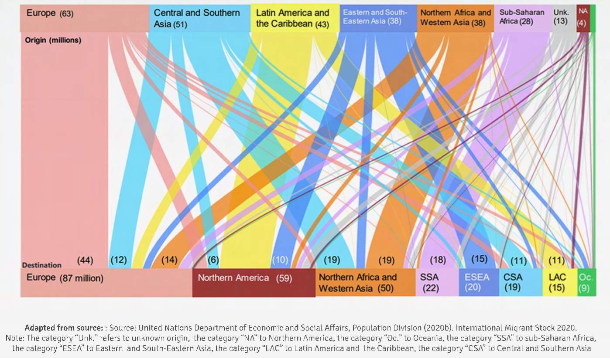{width=100%}
:::

## Persone rifiugiate nel mondo

 
 

:::{.center}
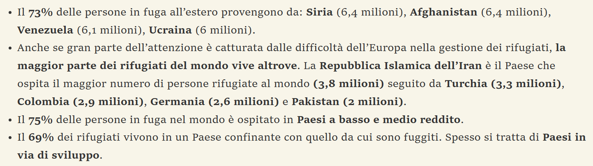{width=120%}
:::

:::{.footer}
Fonte: [UNHCR Global Trends report 2023](https://www.unhcr.org/global-trends-report-2023)
:::

## Km di muro nel mondo: circa 40.000

:::{.center}
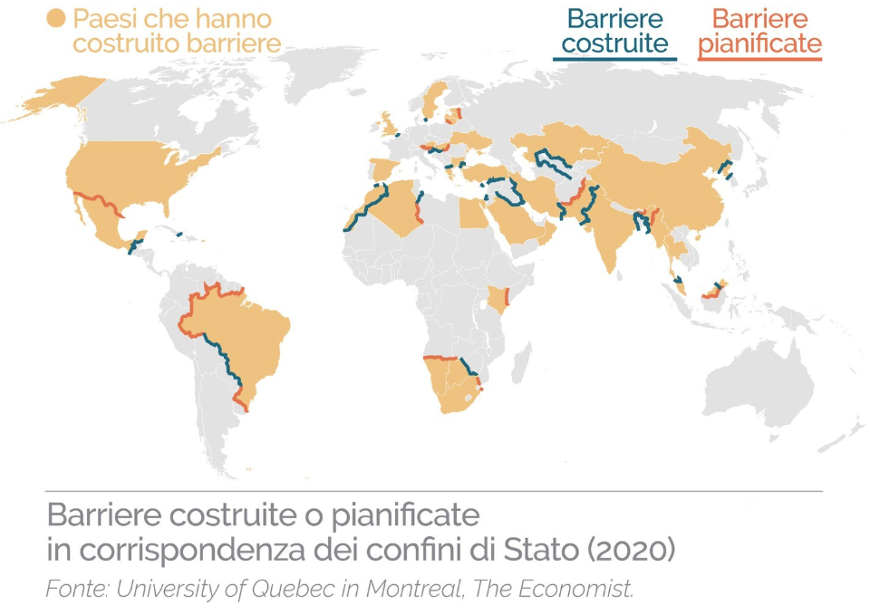{width=85%}
:::

## Km di muro in Europa: oltre 2.000 {.scrollable}

:::{.center}
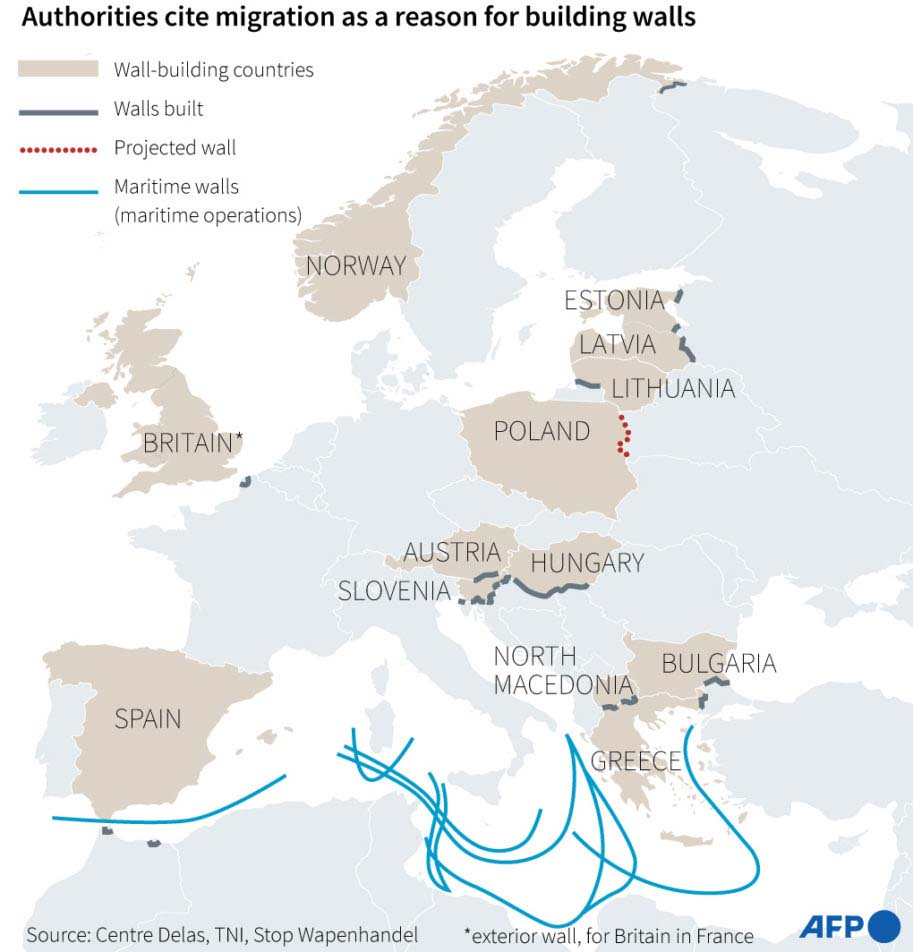{width=85%}
:::

## Un passo indietro: la strage di Lampedusa

:::: {.columns}

::: {.column width="63%"}
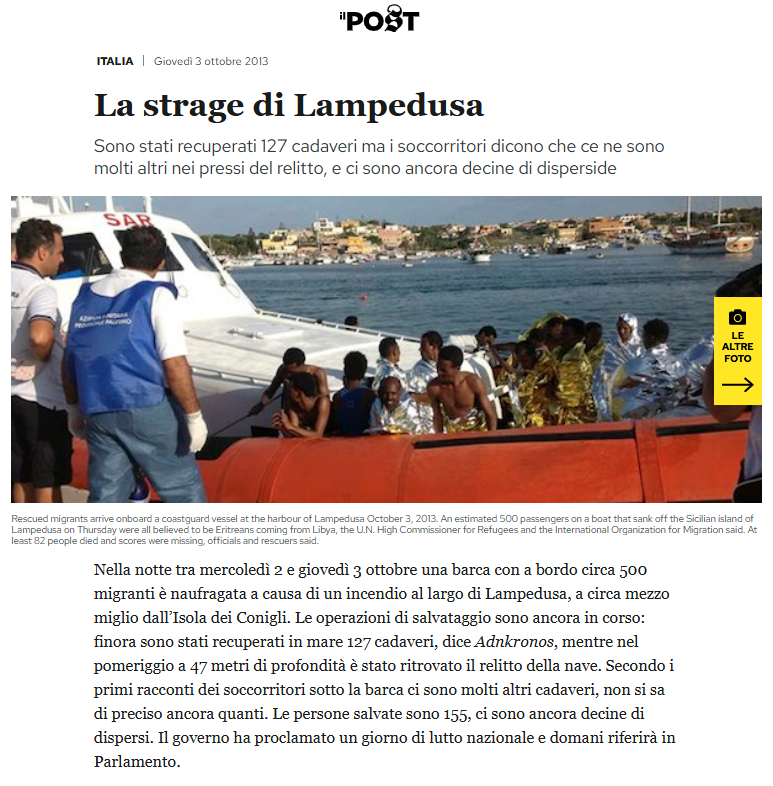{width=100%}
:::
::: {.column width="35%"}
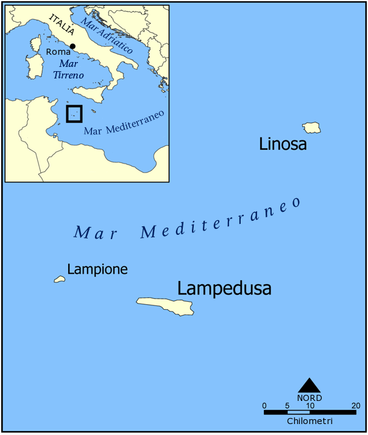{width=100%}

* Il bilancio finale è di 368 morti accertati e oltre 20 dispersi.
:::

::::

:::{.footer}
Fonti: [ilPost](https://www.ilpost.it/2013/10/03/live-naufragio-lampedusa/) e [Wikipedia](https://it.wikipedia.org/wiki/Naufragio_di_Lampedusa_del_3_ottobre_2013)
:::

## Un passo indietro: Mare Nostrum

* [Ottobre 2013:]{.alert} pochi giorni dopo il naufragio di Lampedusa del 3 ottobre, il Governo italiano lancia la missione [*"Mare Nostrum"*]{.alert}.
    - Stanziati 9M euro/mese ed eseguiti 558 interventi di ricerca e soccorso nel Mediterraneo.
    - Oltre 100.000 persone soccorse.
    - Le navi italiane si spingono fino a 400 miglia nautiche a sud di Lampedusa, quasi in prossimità delle coste libiche.

## Un passo indietro: Triton

* [Ottobre 2014:]{.alert} la missione “Mare Nostrum” viene sostituita da [*“Triton”*]{.alert}.    
    - La nuova missione è finanziata non dal Governo italiano ma da [FRONTEX]{.alert}, l'Agenzia europea della guardia di frontiera e costiera.
    - Budget ridotto di due terzi rispetto a Mare Nostrum.
    - L'obiettivo non è più il salvataggio in mare, ma il [controllo delle frontiere]{.alert}.
    - I mezzi non possono spingersi oltre le 30 miglia nautiche di distanza.

## La crescita di Frontex 

:::{.center}
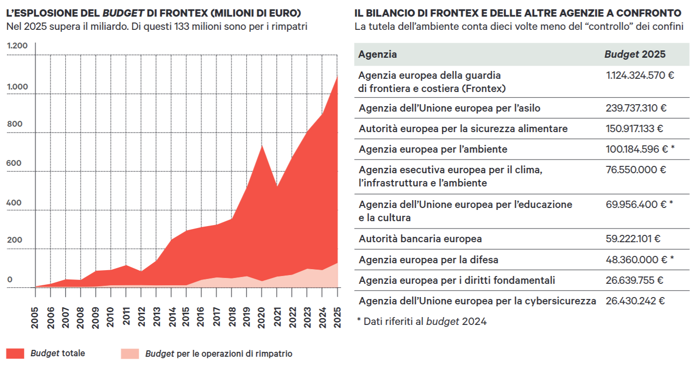{width=100%}
:::

:::{.footer}
Fonte: [Altreconomia](https://altreconomia.it/il-ricatto-europeo-targato-frontex-sui-rimpatri-volontari-dei-migranti/)
:::

## Esternalizzazione delle frontiere 

* [Strategia di controllo delle frontiere]{.alert} adottata dall'UE e dei suoi Stati membri.

* [Sposta il controllo migratorio al di fuori dei propri confini]{.alert}.

* prevede accordi finanziari per delegare a paesi terzi (come Libia e Tunisia) la gestione dei flussi e il blocco delle partenze.

* L'unico elemento che viene preso in considerazione è quello dell'interesse geopolitico.    
     - Vengono aperte trattative con paesi “chiave” unicamente alla luce della loro vicinanza con l’Europa, senza alcun riguardo per il rispetto dei diritti umani.

## Esternalizzazione delle frontiere (2)

:::{.center}
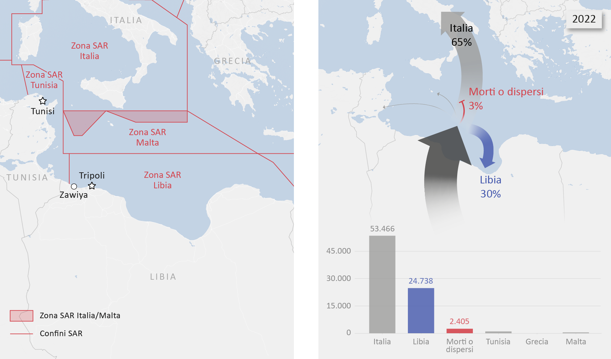{width=100%}
:::

:::{.footer}
Fonte: [Irpimedia](https://irpimedia.irpi.eu/libia-coordinamento-salvataggi-in-mare/)
:::

## Esternalizzazione delle frontiere  (3)

:::{.center}
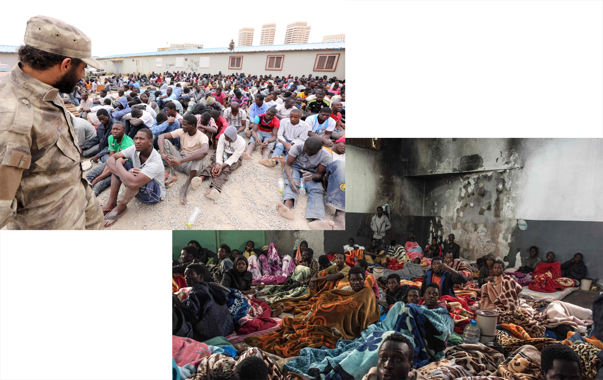{width=85%}
:::

## Esternalizzazione delle frontiere  (4)

:::{.center}
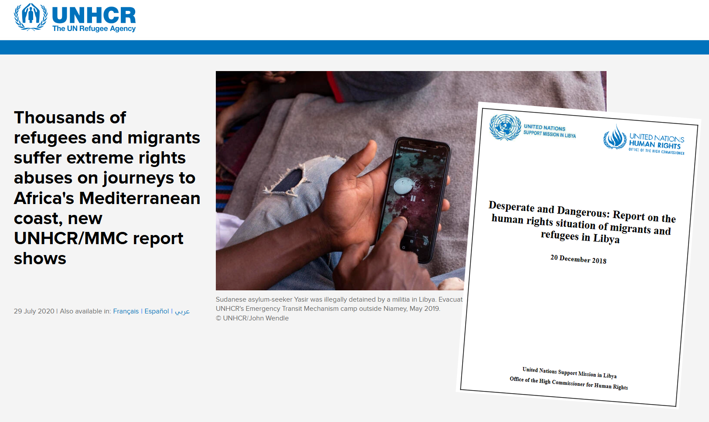{width=100%}
:::

:::{.footer}
Fonte: [Alto commissariato delle Nazioni Unite per i rifugiati](https://www.ohchr.org/sites/default/files/Documents/Countries/LY/LibyaMigrationReport.pdf)
:::

## Esternalizzazione delle frontiere (5)

:::{.center}
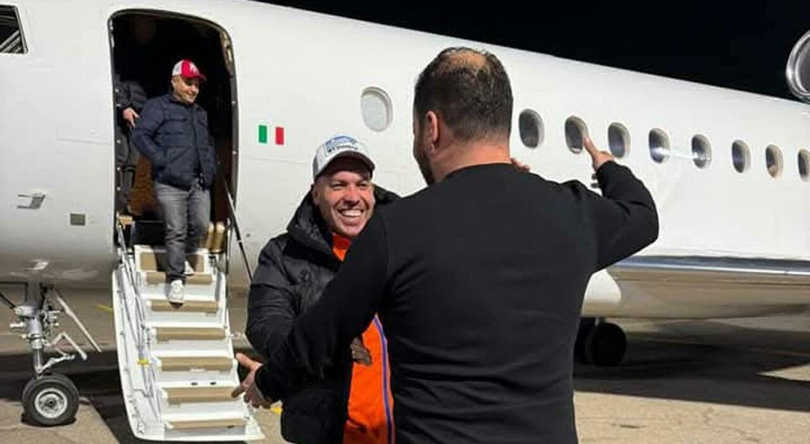{width=80%}
:::

## La nuova frontiera dell'esternalizzazione

### L'accordo Italia-Albania e i centri di Shengjin e Gjader

::: {.center}
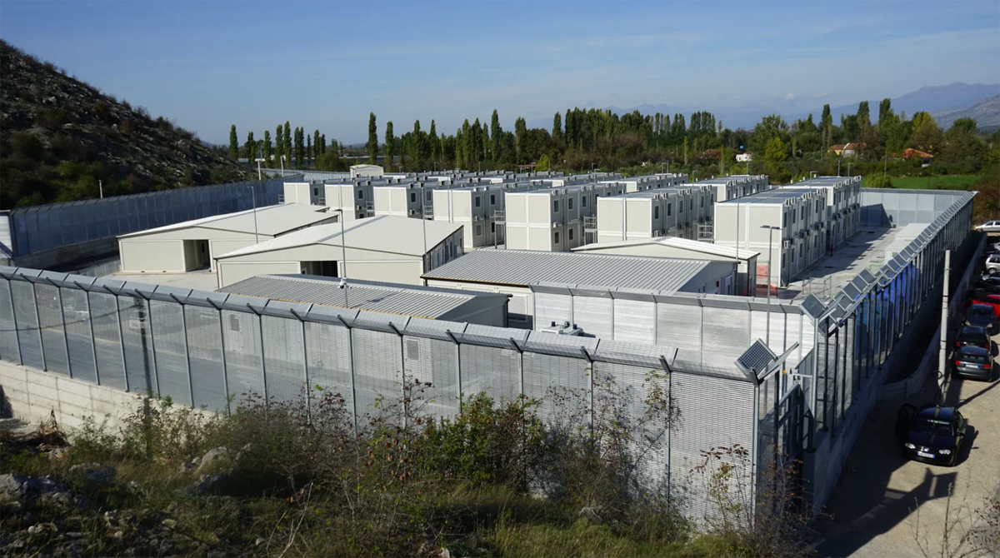{width=85%}
:::

## La flotta civile

* Unica presenza nel Mediterraneo a operare attività di ricerca e soccorso senza finalità di controllo dei confini.

* Occhi indipendenti e voce di denuncia sulle morti provocate dalla politica delle frontiere.

:::{.center}
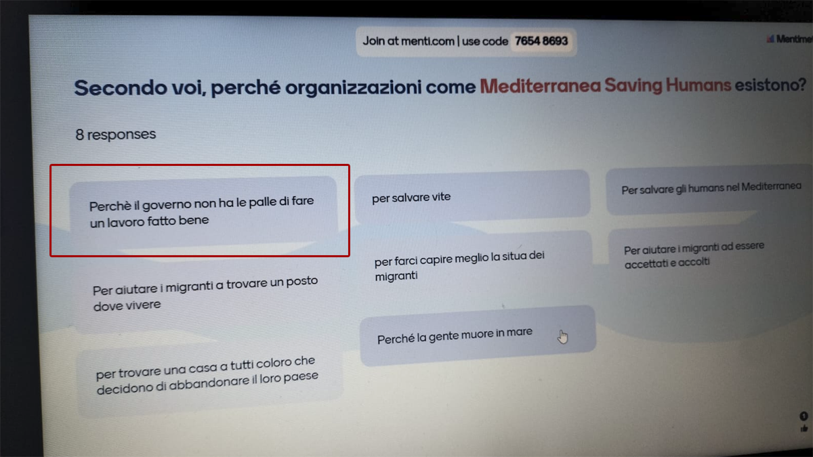{width=100%}
:::

## {background-image="msh_bz_files/civilfleet_2025.png" background-size="contain"}

## La Mare Jonio 

* Salpa il 4 ottobre 2018 da Augusta in risposta alla politica dei porti chiusi dell'allora Ministro dell'Interno Matteo Salvini e all'indignazione per le migliaia di morti nel Mediterraneo.

* Prima e tuttora unica nave del soccorso civile [battente bandiera italiana]{.alert}.

* Tra il 2018 al 2025, 21 missioni in mare e 1447 persone soccorse.

* A partire dal 2025, è stata sostituita da nuova nuova nave, la [Mediterranea Ship]{.alert}.

## {background-image="msh_bz_files/mj2018.jpg" background-opacity=1 background-size="stretch"}

## {background-image="msh_bz_files/mjrhib.png" background-opacity=1 background-size="stretch"}

## {background-image="msh_bz_files/mediterraneaship.jpg" background-opacity=1 background-size="stretch"}

## Le segnalazioni

* Spesso avvengono tramite [Alarm Phone]{.alert}, ma anche grazie ai [velivoli]{.alert} della flotta civile.

:::: {.columns}

::: {.column width="33%"}
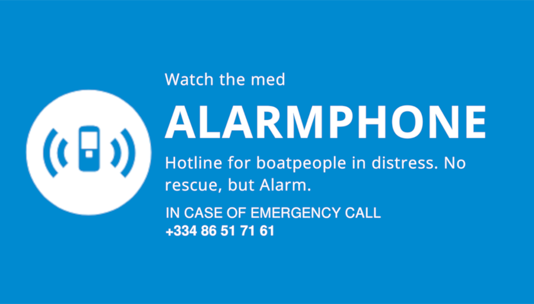{width=100%}
:::

::: {.column width="33%"}
{width=100%}
:::

::: {.column width="33%"}
{width=100%}
:::

::::

## Criminalizzazione della solidarietà: porti lontani

::: {.center}
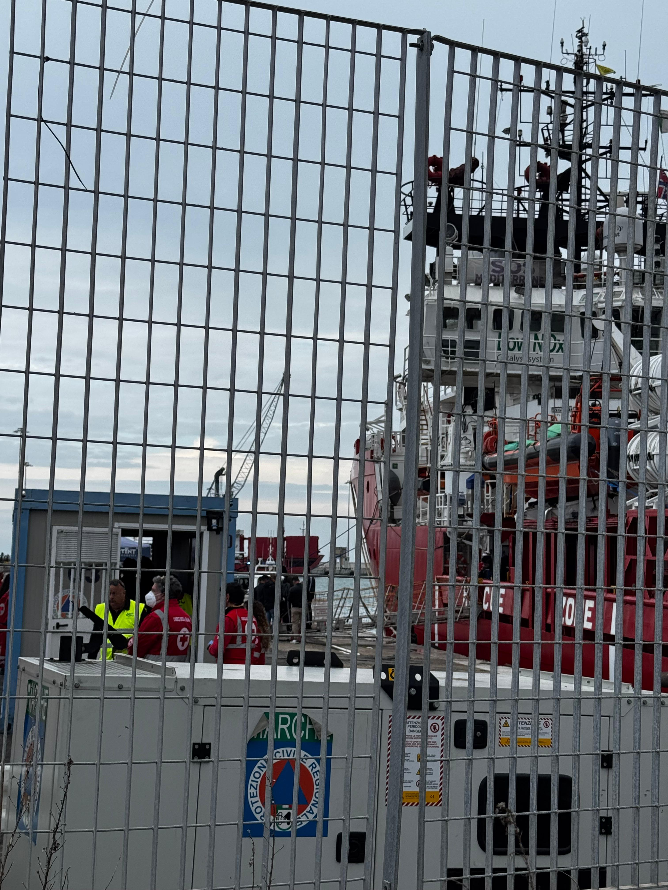{width=40%}
:::

## Criminalizzazione della solidarietà: fermi e multe

::: {.center}
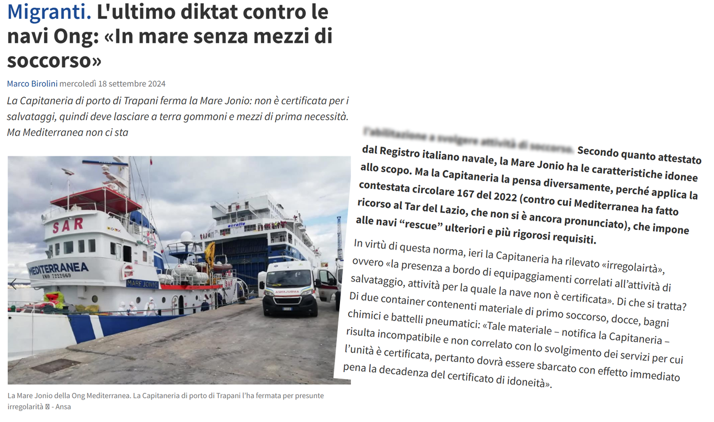{width=90%}
:::

:::{.footer}
Fonte: [Avvenire](https://www.avvenire.it/attualita/pagine/mare-jonio-bloccata)
:::

## Criminalizzazione della solidarietà: la cosiddetta guardia costiera libica



## Criminalizzazione della solidarietà: il caso Paragon

::: {.center}
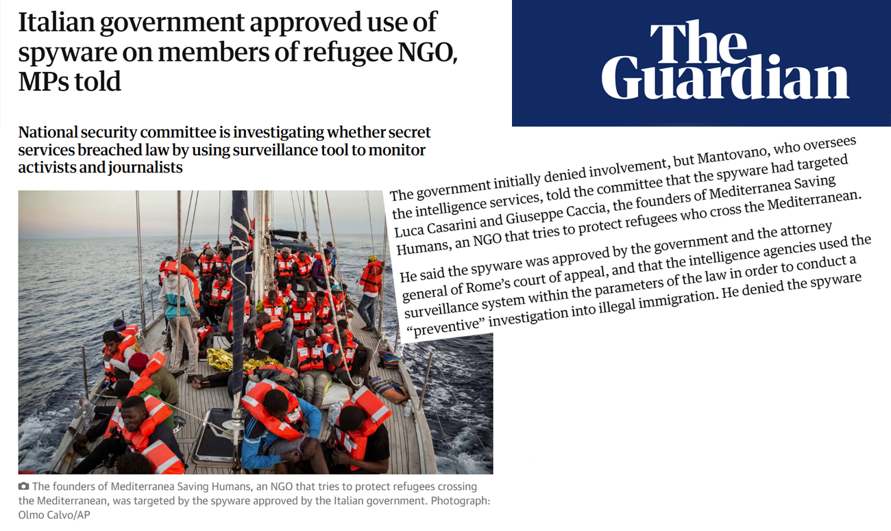{width=90%}
:::

:::{.footer}
Fonte: [The Guardian](https://www.theguardian.com/world/2025/mar/27/italian-government-approved-use-of-spyware-on-members-of-refugee-ngo-mps-told)
:::

## Criminalizzazione della solidarietà: accuse di favoreggiamento dell'immigrazione

::: {.center}
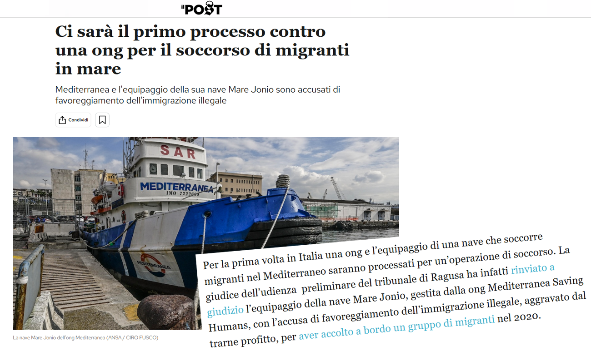{width=85%}
:::

:::{.footer}
Fonte: [Il Post](https://www.ilpost.it/2025/05/29/mare-jonio-processo-salvataggio-migranti-luca-casarini/)
:::

## Le missioni di terra

 

:::: {.columns}

::: {.column width="50%"}
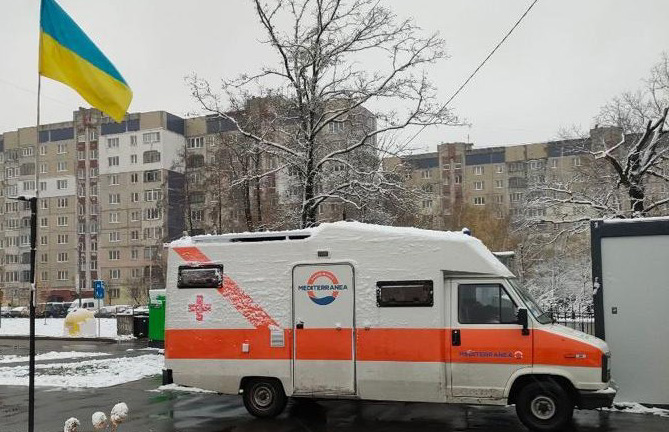{width=100%}
:::
::: {.column width="50%"}
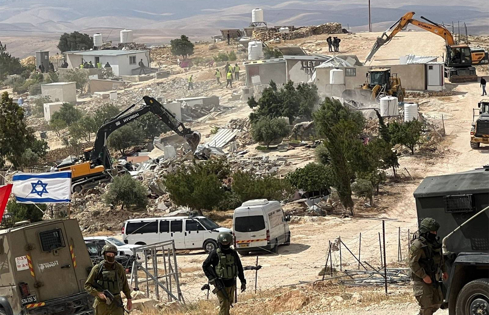{width=100%}
:::

::::

## Le tre fasi della missione in Ucraina
### 1 - *Safe passage*

Foto qui

## Le tre fasi della missione in Ucraina
### 2 - *Medcare*

Foto qui

## Le tre fasi della missione in Ucraina
### 3 - *Missioni di rifornimento, Music&Resilience, serigrafia*

Foto qui

## Ucraina: missione di rifornimento n. 23 
### Dicembre 2025 - Gennaio 2026

Video qui

## Video Jura

Video qui

<!-- ## CPR

* Istituiti per la prima volta nel 1998 (legge Turco-Napolitano).

* Strutture detentive dove vengono reclusi i cittadini stranieri che [non hanno commesso reati]{.alert} ma sono [sprovvisti di permesso di soggiorno]{.alert} in corso di validità (ossia in presenza di un illecito amministrativo).    
    - Si parla per questo di [detenzione amministrativa]{.alert}.
    - Detenzione motivata dall'idea che "la pesona irregolare è potenzialmente pericolosa" (cit. Minniti 2017).

* Il funzionamento è di competenza del Prefetto, che attraverso dei bandi affida la gestione della struttura a [soggetti privati]{.alert}. 

## CPR

* Durata massima del trattenimento: attualmente è [18 mesi]{.alert} (nel tempo è andata crescendo).

* Motivo del trattenimento: permettere l'esecuzione di un decreto di [espulsione]{.alert} o respingimento, dovuto dalla mancanza di permesso di soggiorno.
    - Il rimpatrio avviene di fatto in [meno della metà dei casi]{.alert}.
    - Per rimpatriare una persona serve un accordo bilaterale tra l'Italia e il Paese di provenienza, ma questi accordi mancano con molti Stati. 

## CPR: ingressi, uscite, rimpatri

::: {.center}
{width=80%}
:::

:::{.footer}
Fonte: [ActionAID e Università di Bari](https://trattenuti.actionaid.it/wp-content/uploads/2024/10/Rapporto-Trattenuti_DEF.pdf)
:::

## CPR: capienza

::: {.center}
{width=40%}
:::

:::{.footer}
Fonte: [ActionAID e Università di Bari](https://trattenuti.actionaid.it/wp-content/uploads/2024/10/Rapporto-Trattenuti_DEF.pdf)
:::

## CPR: dove?

::: {.center}
{width=90%}
:::

## CPR: dall'alto

::: {.center}
{width=80%}
:::

## CPR: dentro

{width=50% fig-align="center"} {width=35% fig-align="center"}

## CPR: dentro

::: {.center}

{width=35% fig-align="center"} [......]{.data} {width=35% fig-align="center"}

:::

## CPR: dentro

{width=35% fig-align="center"}

## CPR: valutazione di idoneità {.scrollable}

::: {.center}
{width=80%}
:::

:::{.footer}
Fonte: [CILD](https://cild.eu/wp-content/uploads/2024/11/CILD_Chiusi_in_Gabbia_web.pdf)
:::

<!-- ## CPR: valutazione di idoneità

{width=35% fig-align="center"} -->

<!-- 
## CPR: convalida del giudice di pace

* Durata media dell'udienza: 300 secondi

::: {.center}
{width=70%}
:::

:::{.footer}
Fonte: [ASGI](https://www.asgi.it/wp-content/uploads/2024/05/Lexilium-2024-def.pdf)
:::

## CPR: abuso di psicofarmaci

::: {.center}
{width=100%}
:::

:::{.footer}
Fonte: [Altreconomia](https://altreconomia.it/rinchiusi-e-sedati-labuso-quotidiano-di-psicofarmaci-nei-cpr-italiani/)
:::

## CPR: abuso di psicofarmaci

{width=35% fig-align="center"}

## CPR:  i "servizi"

{width=80% fig-align="center"}

:::{.footer}
Fonte: [CILD](https://cild.eu/wp-content/uploads/2024/11/CILD_Chiusi_in_Gabbia_web.pdf)
:::

<!-- ## CPR: i "servizi"

{width=35% fig-align="center"} -->
