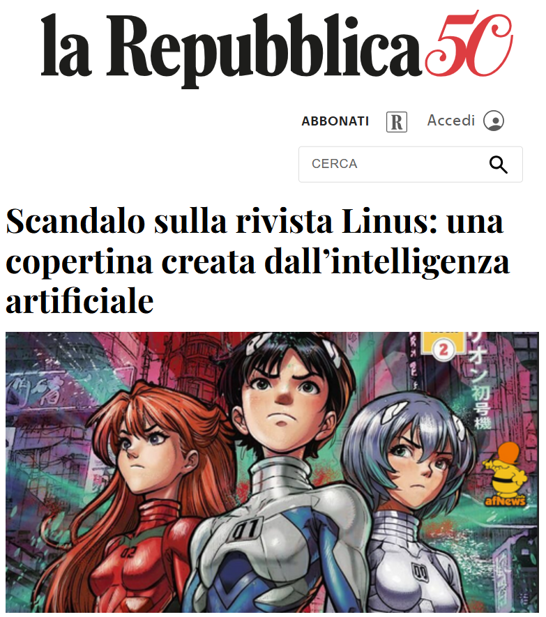
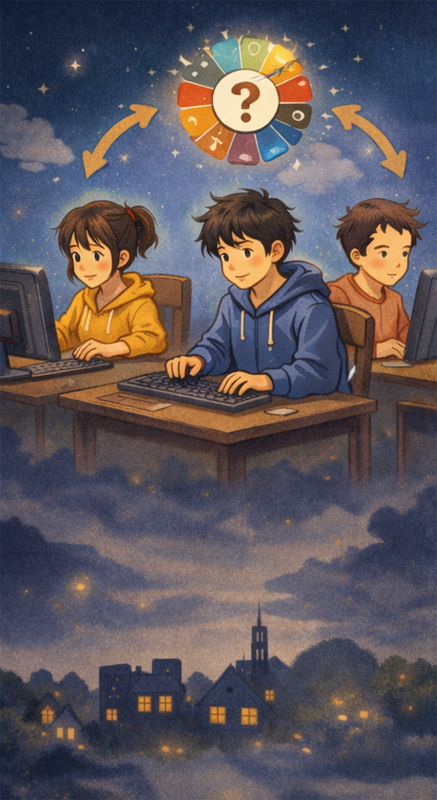
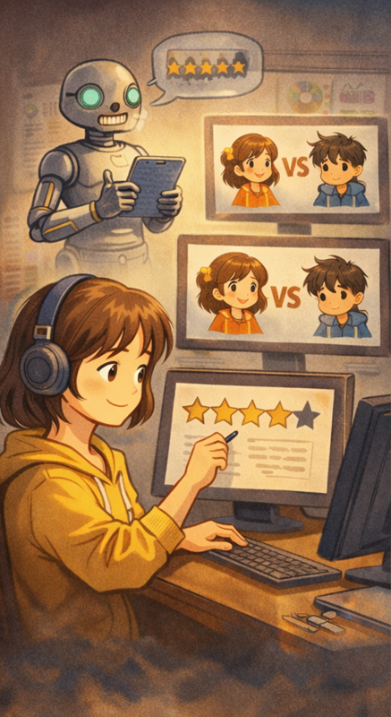
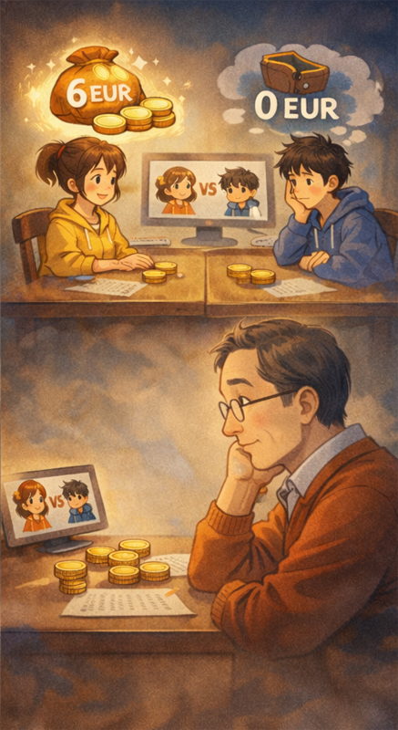
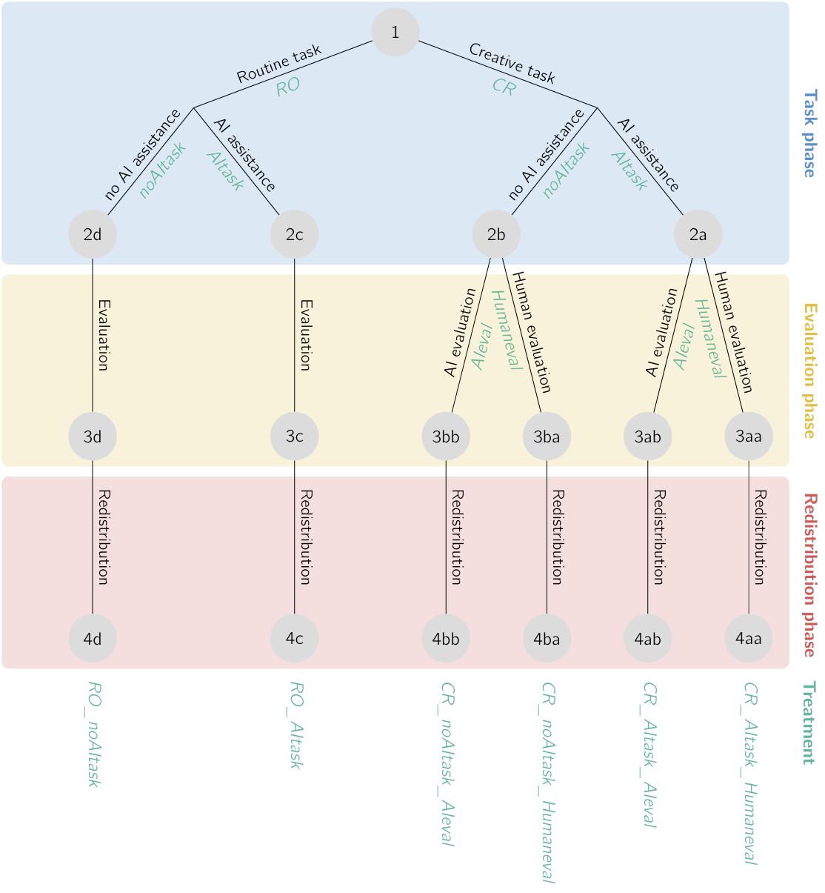
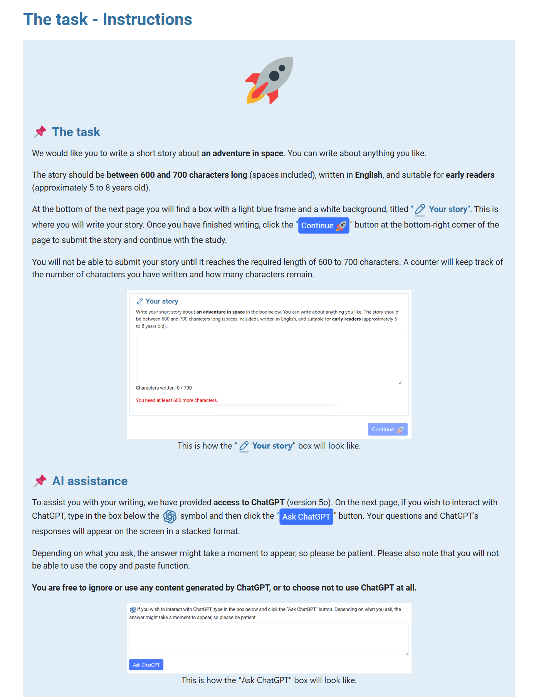
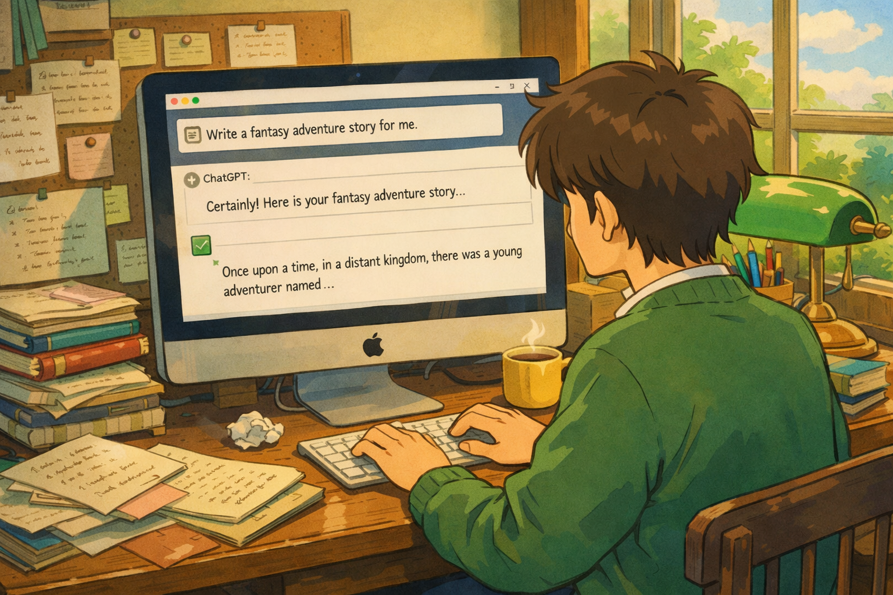

## *linus*, November 2025

:::: {.columns}

::: {.column width="50%"}

:::{.center}
{height=600}
:::

:::

::: {.column width="50%"}
{width=100%}
:::

::::

<!-- ## Wage premia for AI skills

* What about STEM sectors?

* @ehlingerstephany2025 show that: 
    - Between 2018 and 2024, demand for AI skills increased by more than 20% in UK STEM job postings.
    - AI skills [command a significant wage premium]{.alert}, second only to holding a PhD and higher than a master's degree. -->

## Public attitudes toward AI use

* In [technical fields]{.alert}, AI use is increasingly valued and encouraged.     
    - It can increase productivity by speeding up routine, task-driven work.

* In [creative fields]{.alert}, AI is often viewed with skepticism.    
    - E.g. because it may raise doubts about one’s own abilities, effort, or motivation.

* This difference may stem from the belief that [creative activities carry cultural and personal significance]{.alert}.

## Attitudes toward AI use and social preferences

* Is the difference in public acceptance of AI associated with differences in social preferences, specifically [inequality aversion]{.alert}?

* We test whether:    
    1. People perceive income differences as fair when [earnings depend on relative performance]{.alert}, which in turn [depends on AI use]{.alert}.
    2. These fairness perceptions differ between [creative and routine work]{.alert}.

## Methods

* An incentivized experiment that builds on @almasetal2020.

* [Three independent groups of participants]{.alert} recruited online through Prolific:    
    - [Workers]{.workers}
    - [Evaluators]{.evaluators}
    - [Spectators]{.spectators}

## Design overview

:::: {.columns}

::: {.column width="40%"}

{fig-align="right"}

:::

::: {.column width="60%"}

* [Phase 1: task]{.alert}    
    - [Workers]{.workers} are randomly assigned to a treatment group and complete a task.

:::

:::: 

## Design overview (cont'd)

:::: {.columns}

::: {.column width="40%"}

{fig-align="right"}

:::

::: {.column width="60%"}

* [Phase 2: evaluation]{.alert}    
    - We measure the performance of each [worker]{.workers}, either using automated methods or human [evaluators]{.evaluators}.
    - [Workers]{.workers} within each treatment are paired and receive provisional unequal earnings based on their relative performance.

:::

:::: 

## Design overview (cont'd)

:::: {.columns}

::: {.column width="40%"}

{scale="50%" fig-align="right"}

:::

::: {.column width="60%"}

* [Phase 3: redistribution]{.alert}     
    - [Spectators]{.spectators} are randomly matched with a unique pair of [workers]{.workers}. 
    - After being informed about the structure of the experiment and the initial allocation of earnings, [spectators]{.spectators} decide whether to redistribute the earnings and, if so, by how much.

:::

:::: 

## Treatments overview

* Treatments vary along three dimensions:    
    1. [Task]{.alert}: creative ([CR]{.treatment}) or routine ([RO]{.treatment}). 
    2. [AI assistance]{.alert} in task completion: yes ([AItask]{.treatment}) or no ([noAItask]{.treatment}).
    3. [Evaluation of creative work]{.alert}: human-made ([Humeval]{.treatment}) or AI-made ([AIeval]{.treatment}).

* [Six resulting treatments]{.alert}: [CR_AItask_Humeval]{.treatment}, [CR_AItask_AIeval]{.treatment}, [CR_noAItask_Humeval]{.treatment}, [CR_noAItask_AIeval]{.treatment}, [RO_AItask]{.treatment}, [RO_noAItask]{.treatment}

## Treatments overview (cont'd) {.scrollable}

{width=100%}

## The tasks

* 🔢 [Routine task]{.alert}: repeatedly completing a real-effort task (counting zeros in a matrices of numbers). 

* 🚀 [Creative task]{.alert}: writing a 600-700 character story about an adventure in space, suitable for children aged 5-8.

* In conditions [RO_AItask]{.treatment} and [CR_AItask]{.treatment}, workers can interact with a GPT-based chatbot that helps them complete the task. In conditions [RO_noAItask]{.treatment} and and [CR_noAItask]{.treatment}, no chatbot  is provided.

## The tasks: example (condition [CR_AItask]{.treatment}) {.scrollable}

{width=100%}

## Cheating prevention and detection 🕵️

* [Problem:]{.alert} workers may cheat by using generative AI on another device or in a different browser tab.

* [Controls:]{.alert}    
    1. [Self-reported question]{.alert}: "Did you use ChatGPT or a similar generative AI tool [*outside the box provided in this study, for example on another device*] to help you with the task? Please answer truthfully; your honest response will help with our research and will not affect your payment".

## Cheating prevention and detection (cont'd) 🕵️

* [Problem:]{.alert} workers may cheat by using generative AI on another device or in a different browser tab.

* [Controls:]{.alert}    
    2. [Copy-paste of text disabled]{.alert} in condition [noAItask]{.treatment}.

## Cheating prevention and detection (cont'd) 🕵️

* [Problem:]{.alert} workers may cheat by using generative AI on another device or in a different browser tab.

* [Controls:]{.alert}    
    3. In condition [CR]{.treatment}, story [drafts are automatically saved]{.alert} every minute, allowing us to detect the sudden appearance of large chunks of text.

## Cheating prevention and detection (cont'd) 🕵️

* [Problem:]{.alert} workers may cheat by using generative AI on another device or in a different browser tab.

* [Controls:]{.alert}    
    4. Robustness check: [exclusion of observations]{.alert} in the left tail of the completion time distribution in conditions [RO_noAItask]{.treatment} and [CR_noAItask]{.treatment} (i.e. workers with suspiciously low completion times).

## Performance evaluation

* In condition [RO]{.treatment}, performance is measured by the [number of count-the-zeros tasks completed]{.alert} by workers.

* In condition [CR]{.treatment}, performance is measured by the [rating]{.alert} assigned either by an AI (condition [AIeval]{.treatment}) or by an independent sample of human [evaluators]{.evaluators} (condition [Humeval]{.treatment}).
    - Ratings are based on indicators measuring the story's *(1)* novelty, *(2)* writing quality, *(3)* suitability for children, and *(4)* potential to be developed into a full book if a publisher were to read it and hire a professional writer to further develop it [@doshihauser2024]

## Initial allocation of earnings

* Workers within each treatment are paired and receive [unequal earnings based on relative performance]{.alert}.

* The higher-performing worker is [provisionally]{.alert} assigned 6 points; the lower-performing worker is assigned 0 points.

* Points are converted into GBP at the end of the study using a fixed exchange rate.

* In condition [AItask]{.treatment}, the more productive worker is typically the one who relied more heavily on AI assistance.

## Redistribution

* Each [spectator]{.spectators} is randomly matched with a pair of [workers]{.workers}. 

* After being informed about the structure of the experiment, the [spectator]{.spectators}:   
    - Is told who the [evaluators]{.evaluators} were and how performance was assessed.
    - Is told which [worker]{.workers} performed better and the initial earnings allocation.
    - In condition [AItask]{.treatment}, is told which [worker]{.workers} relied more on AI.
    - Decides whether to redistribute the initial earnings and, if so, how much. 

## AI reliance measurement

* In condition [RO]{.treatment}, AI reliance is given by the number of answers provided by the chatbot.

* In condition [CR]{.treatment}, AI reliance is measured using an algorithm that compares the story with the chatbot’s answers, while accounting for grammar- and punctuation-correction requests, and whether each chatbot answer was given before the relevant text appeared in the draft.

## Main variable of interest

*  The inequality implemented by spectator *j* is given by:
 $$ e_j = \frac{\left| \text{Income worker}\ A_j - \text{Income worker}\ B_j \right| }{\text{Total income}} \in \left[ 0, 1 \right] $$
 where Worker $A_j$ is the worker with higher pre-redistribution earnings.

* A higher value of $e_j$ denotes lower inequality aversion:    
    - $e_j = 1$ means no redistribution.
    - $e_j = 0$ means 50-50 redistribution.

## Main research hypotheses

 

::: {.callout-note}
## Hypothesis 1 
Inequality aversion in treatment [RO_AItask]{.treatment} does not significantly differ from inequality aversion in treatment [RO_noAItask]{.treatment}.
:::

* [Possible rationale]{.alert} (to be elicited): In routine work, AI is perceived as a productivity-enhancing tool.    
    - [Workers]{.workers} who rely less on AI and perform worse are perceived by [spectators]{.spectators} as less skilled at using a useful tool.

## Main research hypotheses (cont'd)

 

::: {.callout-note}
## Hypothesis 2
Inequality aversion is significantly higher in treatment [CR_AItask_Humeval]{.treatment} than in treatment [CR_noAItask_Humeval]{.treatment}, and significantly higher in treatment [CR_AItask_AIeval]{.treatment} than in treatment [CR_noAItask_AIeval]{.treatment}.
:::

* [Possible rationale]{.alert} (to be elicited): In creative work, AI is perceived as a form of cheating [@reifetal2025].
    - [Workers]{.workers} who rely less on AI and perform worse are rewarded by [spectators]{.spectators} because their output is seen as the result of greater personal effort.

## Main research hypotheses (cont'd)

 

::: {.callout-note}
## Hypothesis 3
Inequality aversion is significantly higher in treatment [CR_AItask_AIeval]{.treatment} than in treatment [CR_AItask_Humeval]{.treatment}.
:::

* [Possible rationale]{.alert} (to be elicited): the mechanism tested in Hypothesis 2 is further amplified by [spectators]{.spectators}' skepticism toward AI-performed story [evaluation]{.evaluators}.

::: {.center}

##

[Thank you! Comments welcome :)]{.spectators}

{width=100%}

:::

## References

::: {#refs}
:::

